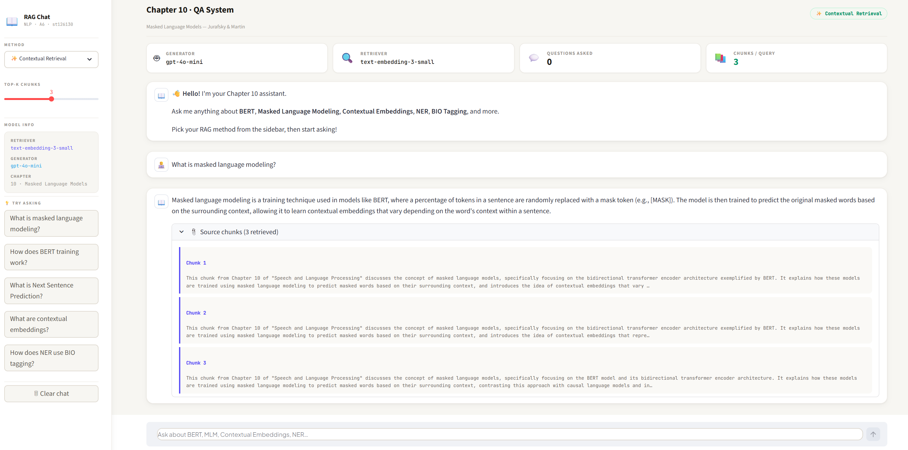

# A6: Naive RAG vs Contextual Retrieval

**Student Name:** Aphisit Jeamyaem

**Student ID:** st126130

**Chapter:** Chapter 10 — Masked Language Models (Jurafsky & Martin, 2026)

---

## Overview

This assignment implements and compares two RAG (Retrieval-Augmented Generation) strategies for a domain-specific QA system built on Chapter 10 of *Speech and Language Processing*:

- **Naive RAG** — standard chunking + vector retrieval
- **Contextual Retrieval** — LLM-enriched chunks with context prefix prepended before embedding

---

## Repository Structure

```
├── README.md
├── A6_notebook_st126130.ipynb          # Main notebook (Tasks 1–3)
├── output.png                          # Web app UI screenshot
├── requirements.txt
├── answer/
│   └── response-st126130-chapter-10.json   # 20 QA evaluation pairs
├── app/
│   ├── app.py                          # Streamlit web application
│   └── chapter10.pdf                   # Source document
└── ref/
    └── NLP_2026_A6_RAG_Techniques.pdf
```

---

## Tasks

### Task 1 — Source Discovery & Data Preparation
- Extracted and cleaned text from `chapter10.pdf` using PyMuPDF (`fitz`)
- Applied cleaning: removed page numbers, collapsed whitespace, fixed hyphenated line breaks
- Created **20 QA pairs** manually from the chapter content

### Task 2 — Technique Comparison

**Models used:**

| Component | Model |
|-----------|-------|
| Retriever (Embedding) | `text-embedding-3-small` |
| Generator | `gpt-4o-mini` |

**Chunking:** `RecursiveCharacterTextSplitter` — chunk size 500, overlap 50 → **136 chunks**

**Contextual Enrichment:** Each chunk is asynchronously enriched with a 1–2 sentence LLM-generated prefix describing its role in the full document before embedding.

**ROUGE Evaluation Results:**

| Method | ROUGE-1 | ROUGE-2 | ROUGE-L |
|--------|---------|---------|---------|
| Naive RAG | 0.4596 | 0.2106 | 0.3417 |
| Contextual Retrieval | 0.4187 | 0.1721 | 0.3060 |

**Analysis:** Naive RAG achieved slightly higher ROUGE scores on this corpus. This is expected because the chapter is relatively short (136 chunks), so standard retrieval already finds relevant chunks without enrichment. The context prefixes added by Contextual Retrieval introduce paraphrased vocabulary that shifts embedding similarity, slightly reducing ROUGE against the ground truth. In larger, more heterogeneous corpora, Contextual Retrieval is expected to outperform Naive RAG.

### Task 3 — Chatbot Web Application

A Streamlit app that allows users to ask questions about Chapter 10. Features:
- Toggle between **Contextual Retrieval** and **Naive RAG** from the sidebar
- Adjustable **Top-K** chunks slider (1–5)
- Displays **source chunks** used for each answer in an expandable section
- Suggested questions for quick testing

**UI Screenshot:**



---

## Setup & Running the App

### Prerequisites
```bash
pip install -r requirements.txt
```

### Environment
Create a `.env` file in the `app/` directory:
```
OPENAI_API_KEY=your_openai_api_key_here
```

### Run
```bash
cd app
streamlit run app.py
```

---

## Dependencies

See `requirements.txt`
